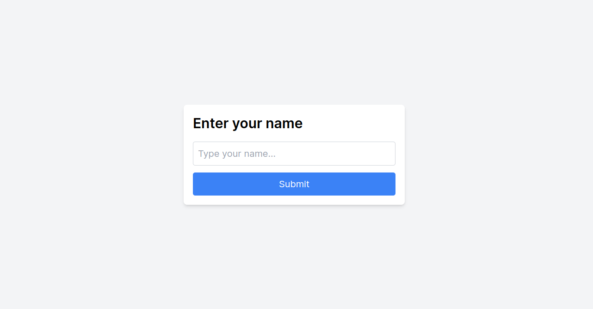
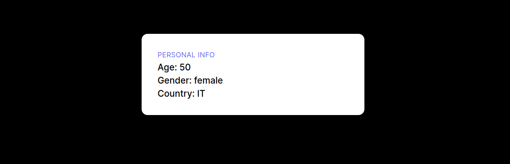

<h1 align="center">Next Tutorial</h1>

  

This project uses 3 APIs to make a predition about age, gender and nationality of a given name, using React JS, Next JS and Tailwind CSS for some style. 

Download the project

In the project directory, you can run:

<i>npm install</i>

<i>npm run dev</i>

	You can find the tutorial here
	<a href="https://www.youtube.com/watch?v=PtDIVU_tlo0&t=256s">
		NextJS Beginner Project Tutorial - Learn NextJS 13 With This Easy Project
	</a>

  
  

